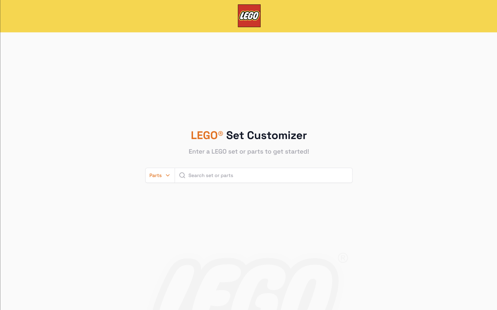

# LEGO® Set Customizer



A web application that allows users to search, customize, and create their own LEGO® sets by combining parts from different sets or adding individual LEGO pieces.

## Features

- **Set Search**: Search for official LEGO sets using set numbers
- **Part Search**: Find specific LEGO parts using part numbers or descriptions
- **Part Selection**: Select multiple parts from sets or individual pieces
- **Custom Set Creation**: Create and save your custom LEGO sets
- **Real-time Filtering**: Filter selected parts within your custom set
- **Responsive Design**: Fully responsive interface that works on desktop and mobile devices

## Live Demo

- **Frontend**: [https://rebrickableapp.vercel.app/](https://rebrickableapp.vercel.app/)
- **Backend API**: [https://rebrickable-laravel-production.up.railway.app/api/custom-sets](https://rebrickable-laravel-production.up.railway.app/api/custom-sets)
- **Design**: [View on Figma](https://www.figma.com/design/P3YGmYK3wM7Aq8XhJ8G2jX/Lego-Design-Home-page)

## Tech Stack

### Frontend
- Next.js 14
- React 18
- SASS/SCSS for styling
- Axios for API requests
- React Modal for dialogs
- UUID for unique identifiers

### Backend
- Laravel
- MySQL
- RESTful API

## Getting Started

1. Clone the repository:
```bash
git clone [repository-url]
```

2. Install dependencies:
```bash
npm install
```

3. Create a `.env.local` file in the root directory with the following variables:
```env
NEXT_PUBLIC_REBRICKABLE_API_KEY=your_api_key
NEXT_PUBLIC_LEGO_API_BASE_URL=https://rebrickable-laravel-production.up.railway.app
```

4. Start the development server:
```bash
npm run dev
```

5. Open [http://localhost:3001](http://localhost:3001) in your browser

## Development

The application runs on port 3001 by default. You can modify this in the `package.json` file:

```json:package.json
startLine: 6
endLine: 8
```

## Project Structure

- `/components` - React components
- `/styles` - Global styles and SCSS modules
- `/utilities` - Helper functions and constants
- `/public` - Static assets
- `/pages` - Next.js pages and API routes

## Contributing

1. Fork the repository
2. Create your feature branch (`git checkout -b feature/AmazingFeature`)
3. Commit your changes (`git commit -m 'Add some AmazingFeature'`)
4. Push to the branch (`git push origin feature/AmazingFeature`)
5. Open a Pull Request

## License

This project is licensed under the MIT License - see the LICENSE file for details.

## Acknowledgments

- [Rebrickable API](https://rebrickable.com/api/) for LEGO set and part data
- [LEGO®](https://www.lego.com/) for inspiration
- Design inspiration from the official LEGO website

---
LEGO® is a trademark of the LEGO Group of companies which does not sponsor, authorize or endorse this project.
